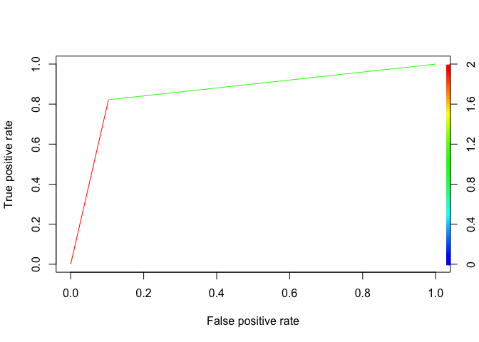

Using Mammogram Data to Predict Breast Mass Malignancies in Females
without Previous Breast Cancer Diagnosis.
================
Erica Ma
2022-12-15

## Introduction

Breast cancer is one of the most common types of cancer in females in
the United States, and despite improvements in therapy and screening,
breast cancer is still the second leading cause of cancer death among
females overall (CDCa 2022). An important tool to lower the risk of
dying from breast cancer and improve one’s survival is early detection
through routine mammograms (CDCb 2022). In fact, breast cancer is one of
the few cancers with an effective method of screening. According to the
CDCb, females between the ages of 50 and 74 are encouraged to get
mammograms every two years, and, depending on previous familial history
of breast cancer, along with other symptoms and risk factors, an
individual’s physician might recommend more frequent or earlier
screenings.

A mammogram is a non-invasive x-ray imaging tool that can show any
abnormalities in the breast tissue, such as calcifications, masses,
asymmetries, or distortions (Mayo Clinic 2022). If mammograms are
determined to have abnormalities, biopsies and more imaging, with tools
such as ultrasounds and MRIs, are encouraged to provide a diagnosis.
Biopsies, however, are invasive and should be treated as such. Some
risks associated with breast biopsies include bruising and swelling of
the breast or infection or bleeding at the site, so unnecessary biopsies
should be avoided. Additionally, mammogram screening has a fairly low
positive predictive value (PPV), such that approximately 70% of the
biopsies done based on mammogram imaging data resulted had benign
outcomes (Elter et al, 2007). In fact, various studies using different
study populations or study data sets have published their PPV to be
anywhere between 4.3% and 52.4%, a discrepancy which could largely be
driven by differences in the patient population being screened, how and
who read the mammograms, characteristics of individual radiologists, and
a difference in health care systems. One of the main goals in breast
cancer detection using mammogram screenings is to decrease the frequency
of false positive diagnosis from mammogram screenings without lowering
the sensitivity, which for a digital mammogram is around 85% (Pisano,
2008).

### Research Question and Data

The goal of this project is to create predictive models based on
mammogram screening data that predicts the severity (benign or
malignant) of the mass in females who have never had breast cancer
before. I hope to answer the question: “Which combination of covariates
and predictive models provide the best prediction of the severity of a
mass in females who have never had breast cancer before?” To do this, I
will be utilizing the Mammographic Mass Dataset from the UCI Machine
Learning Repository, which has 691 observations prior to data cleaning
and 6 columns:

1.  BI-RADS assessment (ordinal, \[0 = needs additional
    imaging/inconclusive, 1 = no mass, 2 = benign, 3 = probably benign,
    4 = suspicious malignancy, 5 = highly suspicious malignancy, 6 =
    known diagnosis/previous tumor\])

2.  Age (continuous, in years)

3.  Shape (nominal, \[round = 1, oval = 2, lobular = 3, irregular = 4\])

4.  Margin (nominal, \[circumscribed = 1, microlobulated = 2, obscured =
    3, ill-defined = 4, spiculated = 5\])

5.  Density (ordinal, \[high = 1, iso = 2, low = 3, fat-containing =
    4\])

6.  Severity (binary, 0 = benign and 1 = malignant) **OUTCOME**

The distribution of the covariates is seen in Figure 1, where I plotted
each covariate distribution as a histogram by whether the outcome was
malignant or benign.  
<!-- -->

### Dealing with Missingness and Filting the Data

The BI-RADS category is an assessment tool used to rate mammogram
screens, and the score is usually assigned by the radiologist reviewing
the image. Since my study is only looking at those who have never been
diagnosed with breast cancer before, I decided to filter out the 0 and 6
values in the BI-RADS category so that the data would better suit the
scope of my project. Upon looking at the distribution of the missingness
for each covariate (Figure 2), I concluded that my data was very likely
missing not at random, and given that, I could not use multiple
imputation methods, as it assumes the data is either missing at random
or missing completely at random. After contemplation, I concluded that a
complete cases analysis was most appropriate since we are not able to
make any assumptions about the NAs, and there would be enough
observations (rows) left over after filtering for complete cases to
build our predictive model.

    ## # A tibble: 2 × 6
    ##   Severity BI.RADS   Age Shape Margin Density
    ##      <int>   <int> <int> <int>  <int>   <int>
    ## 1        0       1     0    19     36      54
    ## 2        1       1     5    11     11      22

### Methodology

To build my models, I decided to use a logistic regression model with
10-fold cross validation to determine the best model fit. A logistic
regression model was chosen given the binary nature of my outcome data,
and cross validation was used to prevent my logistic regression model
from over-fitting the data. Random forest was also used model the data
since the method naturally incorporates ensemble learning, where
individual “trees” in this forest are making independent decisions about
whether the mass is benign or malignant. Ensemble learning helps prevent
over-fitting and reduce the bias in the predictions. To combine the
results of both models, I decided to use ensemble learning by taking the
the average of the logistic regression model and random forest model
malignancy proportions (p-hat) and finding the proportion threshold that
optimizes the accuracy of the combined models.

## Results:

Upon looking at the distributions of each covariate by outcome, as seen
in Figure 1, I found that there was little difference in the
distribution of the density covariate between those who had benign
masses versus those who had malignant masses. I wanted to see if the
density covariate was appropriate to leave within my modeling, so I used
a lasso regression that could penalize any insignificant predictors. The
results of the lasso regression showed me that Density could be
neglected in our analysis. After this determination, I removed the
density covariate from my analysis, which allowed me to retain more
observations for my modeling (decreased missingness to 7.7%, which is
close to the 5% missingness threshold for complete cases). The results
of removing the missing data was a remaining 872 observations to be used
in the prediction modeling.

    ## 6 x 1 sparse Matrix of class "dgCMatrix"
    ##                       s0
    ## (Intercept) -13.38544597
    ## BI.RADS       2.10176158
    ## Age           0.04167974
    ## Shape         0.38635665
    ## Margin        0.26171454
    ## Density       .

For the purpose of this project, the random seed was set at ‘123’. Since
the goal of this project is to create predictive models, it was
important to create a training data set and a testing data set that
could allow us to train a model and later test the model on a separate
part of the data that has never been trained before, respectively. To
accomplish this, I decided to do an 85-15 split, which separated around
85% of the data (741 observations) for training the model and 15% of the
data (131 observations) for testing the model. Furthermore, the outcomes
for the train and test set were isolated from the covariates so that
modeled/fitted outcomes could be compared with the real outcomes.

### Logistic Regression Model with Cross-Validation

For the logistic regression, I used linear terms, as adding quadratic
terms did not seem to contribute much to improving the fit of the data.
The model used consisted of the 4 remaining covariates: BI-RADS, Age,
Shape, and Margin. The model of the odds of having a malignant mass is:

$$
log(\widehat{odds}) = \beta_{0} + \beta_{1} * X_{BIRADS} + \beta{2} * X_{Age} + \beta{3} * X_{Shape} + \beta{4} * X_{Margin}
$$ I used the *caret* package to cross validate and train my logistic
model. A 10-fold cross validation was used to obtain the coefficients
that best fitted my data, as seen in the table below. The summary shows
that all of the covariates are statistically significant with p-values
less than 0.05. Additionally, while holding all other covariates
constant, on average, those with a 1-unit higher BI-RADS score have
8.8976 times the odds of having a malignant mass than those who have a
1-unit lower BI-RADS score. This makes sense since the BI-RADS score is
a physician-assigned evaluation that should be most indicative of the
other variables on whether the mass seems suspicious or not.

    ## Warning: `repeats` has no meaning for this resampling method.

    ## 
    ## Call:
    ## NULL
    ## 
    ## Deviance Residuals: 
    ##     Min       1Q   Median       3Q      Max  
    ## -2.7299  -0.5347  -0.2516   0.4831   3.5774  
    ## 
    ## Coefficients:
    ##               Estimate Std. Error z value Pr(>|z|)    
    ## (Intercept) -14.244424   1.107469 -12.862  < 2e-16 ***
    ## BI.RADS       2.185779   0.240494   9.089  < 2e-16 ***
    ## Age           0.047043   0.008977   5.240  1.6e-07 ***
    ## Shape         0.434914   0.118715   3.664 0.000249 ***
    ## Margin        0.265218   0.095299   2.783 0.005386 ** 
    ## ---
    ## Signif. codes:  0 '***' 0.001 '**' 0.01 '*' 0.05 '.' 0.1 ' ' 1
    ## 
    ## (Dispersion parameter for binomial family taken to be 1)
    ## 
    ##     Null deviance: 1020.81  on 740  degrees of freedom
    ## Residual deviance:  561.41  on 736  degrees of freedom
    ## AIC: 571.41
    ## 
    ## Number of Fisher Scoring iterations: 5

The final model had a 0.8434 accuracy on the training set data.

After determining the best logistic model for the data, I wanted to
determine the best probability threshold to compare the outcome
probabilities against. Since the data is binary, the outcome can only be
a 0 or a 1, but the prediction is given as a set of probabilities of
each observation being a malignant case (p) or a benign case (1-p). It
is common to use 0.5 as the cut-off, but I decided to test different
probabilities to see if I could use a different threshold to improve the
accuracy of my model. As seen from my code below, I did 1,000
replicates, where I partitioned the observations in a 80-20 split each
time to create a new train and test test, respectively, from my training
set data. Then I used the different probability thresholds to obtain
y_hat, and I compared y_hat to the actual outcomes and calculated the
accuracy using a confusion matrix. The histograms show that different
probability thresholds resulted in very similar accuracy distributions
and seem to perform fairly similarly. From averaging the accuracies,
however, I found that a threshold of 0.45 for my logistic regression
model was best in optimizing the accuracy.

    ##      p0.4     p0.45      p0.5     p0.55      p0.6 
    ## 0.8450067 0.8513490 0.8452013 0.8381544 0.8298993

<!-- -->

I used the new fitted model and probability threshold of 0.45 to predict
the outcomes on my test data set. The result was an accuracy of 0.8397,
a sensitivity of 0.8621, and a specificity of 0.8219. Additionally, I
calculated the PPV of 0.8824, which tells me that of the of those who
were predicted to have a malignant mass in the test set, 88.23% of them
actually have a malignant mass. An ROC is plotted below with the AUC
being 0.8420, which suggests that it can distinguish the difference
between positive (malignant) and negative (benign) cases, but nor
perfectly.

    ##                 Value
    ## Sensitivity 0.8620690
    ## Specificity 0.8219178
    ## Accuracy    0.8396947
    ## PPV         0.8823529

<!-- -->

### Random Forest Model with Cross-Validation

The random forest model was used for its classification ability and its
ability to incorporate ensemble learning to determine the best model. I
paired random forest with a 10-fold cross validation. The random forest
model was trained with 501 trees and a tune length of 4, which is the
number of covariates it can consider using. Based on the model, the best
model utilized an mtry of 2 to obtain an accuracy of 0.8381. Afterwards,
I did another 1,000 replicates to find the optimal probability
threshold. The results showed that the optimal probability threshold is
0.45.

    ## Warning: `repeats` has no meaning for this resampling method.

    ## note: only 3 unique complexity parameters in default grid. Truncating the grid to 3 .

<!-- -->

    ##     Accuracy     Kappa Resample
    ## 1  0.8378378 0.6737693   Fold02
    ## 2  0.9189189 0.8387800   Fold01
    ## 3  0.7972973 0.5873606   Fold03
    ## 4  0.8356164 0.6681818   Fold06
    ## 5  0.8133333 0.6233859   Fold05
    ## 6  0.7972973 0.5928100   Fold04
    ## 7  0.8356164 0.6699322   Fold07
    ## 8  0.8133333 0.6214852   Fold10
    ## 9  0.8513514 0.6987417   Fold09
    ## 10 0.8800000 0.7572816   Fold08

    ##        V1        V2        V3        V4        V5 
    ## 0.8450067 0.8513490 0.8452013 0.8381544 0.8298993

<!-- -->

I ran the random forest model and the probability threshold of 0.45
using my test data set, which resulted in an accuracy of 0.8550. I saw a
sensitivity of 0.8966 and an specificity of 0.8219. Additionally, a PPV
of 0.9091, which indicates that proportion of people with a positive
test (test says they are malignant) who actually have malignant masses
is 90.91%. From my ROC graph for the random forest model, the AUC was
0.8592. This along with the accuracy, sensitivity, and PPV suggests that
the random forest model is slightly better than the logistic model in
distinguishing the difference between malignant and benign cases. Both
the logistic regression model and random forest models have good ability
to identify malignant masses from the mammogram data.

    ##                 Value
    ## Sensitivity 0.8965517
    ## Specificity 0.8219178
    ## Accuracy    0.8549618
    ## PPV         0.9090909

<!-- -->

### Ensemble Learning

After seeing that the two models performed similarly, I wanted to
combine them using ensemble learning to see if their combined effects
could improve the accuracy and PPV and by how much. I used the average
of their p_hat values, which is the probability that each observation
has a malignant outcome, and found the optimal probability threshold
using the training set and 1,000 replicates. I determined that 0.45 was
the optimal probability threshold.

    ##      p0.4     p0.45      p0.5     p0.55      p0.6 
    ## 0.8701141 0.8779128 0.8759262 0.8748255 0.8713826

<!-- -->

Using an average of the random forest and the logistic regression model,
I saw an accuracy of 0.8626. The sensitivity was 0.8966, specificity was
0.8356, and the PPV was 0.9104. From my ROC graph for the mixed models,
the AUC was 0.8661.

    ##                 Value
    ## Sensitivity 0.8965517
    ## Specificity 0.8356164
    ## Accuracy    0.8625954
    ## PPV         0.9104478

<!-- -->

## Conclusion:

In conclusion, I believe the mixed model that averaged the logistic
regression model and random forest model was the best in maximizing the
accuracy, specificity, and PPV. This mixed model’s sensitivity was
around the same as that of the random forest model, which performed
better than the logistic regression model. This is expected since by
averaging the proportions of being malignant helps the model make better
decisions on borderline values, since one model might have identified
certain observations with higher probability of being malignant while
another model might have decided that they were just below the threshold
of being malignant. Thus, by averaging the two together, those that were
previously on the threshold would have greater probabilities of being
malignant. I believe that my analysis was fairly successful in obtaining
a high PPV in my test set; however, I cannot speak for the
generalizability of my model since there is little data on how the data
was collected. So, if the data was collected by the same physician or
breast cancer clinic, they may have less variability in encoding and
identifying the covariates versus if multiple clinics had contributed to
this data. Additionally, I would like to test this model on a complete
different data set with similar covariates to see if the model would
also obtain a higher PPV and accuracy. Given more time, I would reach
out to breast cancer facilities in the United States to assemble a
larger dataset that I can apply this model on and also reach out to
professionals in the field to see what other covariates are important
for prediction models in this subject matter.

## References:

**Data Set**:  
M. Elter, R. Schulz-Wendtland and T. Wittenberg (2007) The prediction of
breast cancer biopsy outcomes using two CAD approaches that both
emphasize an intelligible decision process.
<http://archive.ics.uci.edu/ml/datasets/mammographic+mass> Medical
Physics 34(11), pp. 4164-4172

**Literature**:  
CDCa “Basic Information about Breast Cancer.” Centers for Disease
Control and Prevention, Centers for Disease Control and Prevention, 26
Sept. 2022, <https://www.cdc.gov/cancer/breast/basic_info/index.htm>.

CDCb “What Is Breast Cancer Screening?” Centers for Disease Control and
Prevention, Centers for Disease Control and Prevention, 26 Sept. 2022,
<https://www.cdc.gov/cancer/breast/basic_info/screening.htm>.

Mayo Clinic. “Breast Biopsy.” Mayo Clinic, Mayo Foundation for Medical
Education and Research, 18 Sept. 2021,
<https://www.mayoclinic.org/tests-procedures/breast-biopsy/about/pac-20384812#>:\~:text=Risks%20associated%20with%20a%20breast,and%20how%20the%20breast%20heals.

Pisano, Etta D et al. “Diagnostic accuracy of digital versus film
mammography: exploratory analysis of selected population subgroups in
DMIST.” Radiology vol. 246,2 (2008): 376-83.
<doi:10.1148/radiol.2461070200>

## Appendix:

``` r
# Import necessary packages: 
library(tidyverse)
library(ggplot2)
library(misty)
library(mice)
library(glmnet)
library(mice)
library(caret)
library(randomForest)
library(ROCR)
library(ggpubr)
# Import data: 
mammogram_data <- read.csv("mammographic_masses.csv")

# Explore data frame
str(mammogram_data)
colnames(mammogram_data)
nrow(mammogram_data)

# Turn characters into integers and ? into NAs. Removing 0 and 6 from BI.RADS since they are outside the scope of our project. 
mammogram_data <- mammogram_data %>% mutate(
  BI.RADS = ifelse(BI.RADS %in% c("?"), NA, as.integer(BI.RADS)), 
                          Age = ifelse(Age == "?", NA, as.integer(Age)), 
                          Shape = ifelse(Shape == "?", NA, as.integer(Shape)), 
                          Margin = ifelse(Margin == "?", NA, as.integer(Margin)), 
                          Density = ifelse(Density == "?", NA, as.integer(Density)), 
                          Severity = ifelse(Severity == "?", NA, as.integer(Severity))) %>%
  filter(!BI.RADS %in% c("0", "6"))

# Identifying any strange inputs
## Found a typo for BI.RADS, was previously 55 but range is from 0 to 6, so I am making the assumption that they mistyped and it is a 5. 
mammogram_data[which((!mammogram_data$BI.RADS %in% c(seq(0, 6))) & !is.na(mammogram_data$BI.RADS)), ]$BI.RADS <- 5

# Looking at Missingness: Those with Severity = 0 seem to have more missingness
mammogram_data %>% group_by(Severity) %>%
  summarize(BI.RADS = sum(is.na(BI.RADS)), Age = sum(is.na(Age)), 
            Shape = sum(is.na(Shape)), Margin = sum(is.na(Margin)), 
            Density = sum(is.na(Density)))
## Testing for type of missingness: Showed that data is not MCAR --> cannot rule out MNAR/MAR
na.test(mammogram_data) 

## How many observations have missing data them
sum(!complete.cases(mammogram_data))
## 13.65% observations have missing data:
sum(!complete.cases(mammogram_data))/nrow(mammogram_data) 

## Decided to filter out all NAs because it is not possible to determine or infer the scores of missing covariate values based on known covariate values of same subject. 
complete_data <- mammogram_data[which(complete.cases(mammogram_data)), ]
str(complete_data)
colnames(complete_data)
nrow(complete_data)

## Factorize the outcome: 
complete_data <- complete_data %>% mutate(Severity = as.factor(Severity))
class(complete_data$Severity)
# Figure 1
a = complete_data %>% ggplot(aes(x = BI.RADS)) + geom_histogram(color = "black", fill = "red", alpha = 0.5, binwidth = 1) + facet_wrap(~Severity)

b = complete_data %>% ggplot(aes(x = Age)) + geom_histogram(color = "black", fill = "gold", alpha = 0.5, binwidth = 5) + facet_wrap(~Severity)

c = complete_data %>% ggplot(aes(x = Shape)) + geom_histogram(color = "black", fill = "darkgreen", alpha = 0.5, binwidth = 1) + facet_wrap(~Severity)

d = complete_data %>% ggplot(aes(x = Margin)) + geom_histogram(color = "black", fill = "navy", alpha = 0.5, binwidth = 1) + facet_wrap(~Severity)

e = complete_data %>% ggplot(aes(x = Density)) + geom_histogram(color = "black", fill = "purple", alpha = 0.5, binwidth = 1) + facet_wrap(~Severity)
# Just from the histograms alone, density doesn't seem to provide much in predicting severity, but upon my research, density is important because it the higher the density levels, the more difficult it is to detect abnormalities in the tissue (so biopsies are more likely to be needed). 
ggarrange(a, b, c, d, e, ncol = 2, nrow = 3, labels = c("BI.RADS", "Age", "Shape", "Margin", "Density"))
mammogram_data %>% group_by(Severity) %>%
  summarize(BI.RADS = sum(is.na(BI.RADS)), Age = sum(is.na(Age)), 
            Shape = sum(is.na(Shape)), Margin = sum(is.na(Margin)), 
            Density = sum(is.na(Density)))
x_complete <- complete_data %>% select(-Severity)
colx_complete <- colnames(x_complete)
x_complete <- matrix(as.numeric(as.matrix(x_complete)), ncol = 5)
y_complete <- as.matrix(complete_data %>% select(Severity))
colnames(x_complete) <- colx_complete
cv_model <- cv.glmnet(x_complete, y_complete, nfolds = 10, family = "binomial")
min_lambda <- cv_model$lambda.min
lasso_mod <- glmnet(x_complete, y_complete, family = "binomial", alpha = 1, lambda = min_lambda)
coef(lasso_mod)
complete_no_density <- mammogram_data %>% select(-Density)
sum(!complete.cases(complete_no_density))/nrow(complete_no_density)  #7.72%
my_dat <- complete_no_density[which(complete.cases(complete_no_density)), ]
# Set seed
set.seed(123)

# Hold out data as test_set
index = sample(1:nrow(my_dat), ceiling(0.15*nrow(my_dat)))
train_set = my_dat %>% slice(-index) %>% mutate(Severity = as.factor(Severity))
test_set = my_dat %>% slice(index)

# Separate Outcomes and Covariates: 
y = train_set$Severity
y_train = train_set %>% select(Severity)
x_train = train_set %>% select(-Severity)
x_test = test_set %>% select(-Severity)
y_test_vector = as.factor(test_set$Severity)
y_train_vector = train_set$Severity

# Cross Validation
fit.control <- trainControl(method = "cv", number = 10, repeats = 10)

# Logistic Model with Cross Vallidation
fit1 <- train(Severity ~ BI.RADS + Age + Shape + Margin, data = train_set, method = "glm", family = "binomial", trControl = fit.control)
summary(fit1)
# Set Seed for reproducibility
set.seed(123)
p = c(0.4, 0.45, 0.5, 0.55, 0.6)
# Create a training set and a testing set
acc_matrix  = sapply(p, function(p){
  replicate(1000, {
  test_index = createDataPartition(y, times =1, p =0.2, list =FALSE)
  to_train = train_set %>% slice(-test_index)
  to_test = train_set %>% slice(test_index)
  test_x = to_test %>% select(-Severity)
  y_hat = ifelse(predict(fit1, newdata = to_test, type = "prob")$"1" > p, 1, 0)
  to_test$Severity
  confusionMatrix(as.factor(y_hat), as.factor(to_test$Severity))$overall[["Accuracy"]]
  })
})
p_names = c("p0.4", "p0.45", "p0.5", "p0.55", "p0.6")
accuracy_glm = as.data.frame(acc_matrix)
colnames(accuracy_glm) <- p_names
averages = accuracy_glm %>% colMeans()
averages
accuracy_distr = accuracy_glm %>% gather() %>% ggplot(aes(value)) + geom_histogram(bins = 25) + facet_wrap(~key)
accuracy_distr
p_hat <- predict(fit1, test_set, type = "prob")
y_hat <- ifelse(p_hat[,2] > 0.45, 1, 0)
cm <- confusionMatrix(as.factor(y_hat), as.factor(test_set$Severity))
accuracy_cm = cm$overall[["Accuracy"]]
s_glm = as.data.frame(cm$byClass[c("Sensitivity", "Specificity")])
results = as.data.frame(cbind(y_hat, y = test_set$Severity))
ppv_glm = results %>% filter(y_hat == 1) %>% summarize(PPV = mean(y)) %>% pull()

table_glm = rbind(s_glm, "Accuracy" = accuracy_cm, "PPV" = ppv_glm)
colnames(table_glm) = "Value"
table_glm

roc_pred_glm <- prediction(predictions = y_hat, labels = test_set$Severity)
roc_perf <- performance(roc_pred_glm , "tpr" , "fpr")
plot(roc_perf,
     colorize = TRUE,
     text.adj=c(-0.2,1.7))

auc_ROCR <- performance(roc_pred_glm, measure = "auc")@y.values[[1]]
set.seed(123)
rf.control = trainControl(method = "cv", number = 10, repeats = 10)
train.rf = train(Severity ~ .,
                 data = train_set,
                 method = "rf", 
                 ntree = 501,
                 trControl = rf.control, 
                 tuneLength = 4, 
                 nSamp = 500)
plot(train.rf)
train.rf$resample

fit.rf = randomForest(Severity ~ ., data = train_set, mtry = 2)
y_hat_rf = predict(fit.rf, x_test)
cm.rf <- confusionMatrix(y_hat_rf, y_test_vector)
#cm.rf$overall["Accuracy"]
#summary(fit.rf)
p = c(0.4, 0.45, 0.5, 0.55, 0.6)
set.seed(123)
acc_matrix.rf  = sapply(p, function(p){
  replicate(1000, {
  test_index = createDataPartition(y, times =1, p =0.2, list =FALSE)
  to_train = train_set %>% slice(-test_index)
  to_test = train_set %>% slice(test_index)
  test_x = to_test %>% select(-Severity)
  y_hat = ifelse(predict(fit.rf, newdata = to_test, type = "prob")[,2] > p, 1, 0)
  to_test$Severity
  confusionMatrix(as.factor(y_hat), as.factor(to_test$Severity))$overall[["Accuracy"]]
  })
})
p_names = c("p0.4", "p0.45", "p0.5", "p0.55", "p0.6")
colnames(acc_matrix.rf) = p_names
accuracy_rf = as.data.frame(acc_matrix)
averages.rf = accuracy_rf %>% colMeans()
averages.rf
accuracy_distr.rf = accuracy_rf %>% gather() %>% ggplot(aes(value)) + geom_histogram(bins = 25) + facet_wrap(~key)
accuracy_distr.rf
p_hat_rf <- predict(fit.rf, test_set, type = "prob")
y_hat.rf <- ifelse(p_hat_rf[,2] > 0.45, 1, 0)
cm.rf <- confusionMatrix(as.factor(y_hat.rf), as.factor(test_set$Severity))
accuracy_rf = cm.rf$overall[["Accuracy"]]
s_rf = as.data.frame(cm.rf$byClass[c("Sensitivity", "Specificity")])

results_rf = as.data.frame(cbind(y_hat.rf, y = test_set$Severity))
ppv_rf = results_rf %>% filter(y_hat.rf == 1) %>% summarize(PPV = mean(y)) %>% pull()
#ppv_rf

table_rf = rbind(s_rf, "Accuracy" = accuracy_rf, "PPV" = ppv_rf)
colnames(table_rf) = "Value"
table_rf

roc_pred_rf <- prediction(predictions = y_hat.rf, labels = test_set$Severity)
roc_perf_rf <- performance(roc_pred_rf , "tpr" , "fpr")
plot(roc_perf_rf,
     colorize = TRUE,
     text.adj=c(-0.2,1.7))

auc_ROCR_rf <- performance(roc_pred_rf, measure = "auc")@y.values[[1]]
set.seed(123)
#p_hat_ensemble = (p_hat[,2] + p_hat_rf[,2])/2
# Create a training set and a testing set
acc_matrix.en  = sapply(p, function(p){
  replicate(1000, {
  test_index = createDataPartition(y, times =1, p =0.2, list =FALSE)
  to_train = train_set %>% slice(-test_index)
  to_test = train_set %>% slice(test_index)
  test_x = to_test %>% select(-Severity)
  phat.rf = predict(fit.rf, newdata = to_test, type = "prob")[,2]
  phat.glm = predict(fit1, newdata = to_test, type = "prob")[,2]
  phat = (phat.rf + phat.glm)/2
  y_hat = ifelse(phat > p, 1, 0)
  to_test$Severity
  confusionMatrix(as.factor(y_hat), as.factor(to_test$Severity))$overall[["Accuracy"]]
  })
})
p_names = c("p0.4", "p0.45", "p0.5", "p0.55", "p0.6")
colnames(acc_matrix.en) = p_names
accuracy_en = as.data.frame(acc_matrix.en)
averages.en = accuracy_en %>% colMeans()
averages.en
accuracy_distr.en = accuracy_en %>% gather() %>% ggplot(aes(value)) + geom_histogram(bins = 25) + facet_wrap(~key)
accuracy_distr.en
p_hat.en <- (p_hat + p_hat_rf)/2
y_hat.en <- ifelse(p_hat.en[,2] > 0.45, 1, 0)
cm.en <- confusionMatrix(as.factor(y_hat.en), as.factor(test_set$Severity))
accuracy_en = cm.en$overall[["Accuracy"]]
s_en = as.data.frame(cm.en$byClass[c("Sensitivity", "Specificity")])

results_en = as.data.frame(cbind(y_hat.en, y = test_set$Severity))
ppv_en = results_en %>% filter(y_hat.en == 1) %>% summarize(PPV = mean(y)) %>% pull()
#ppv_en

table_en = rbind(s_en, "Accuracy" = accuracy_en, "PPV" = ppv_en)
colnames(table_en) = "Value"
table_en

roc_pred_en <- prediction(predictions = y_hat.en, labels = test_set$Severity)
roc_perf_en <- performance(roc_pred_en , "tpr" , "fpr")
plot(roc_perf_en,
     colorize = TRUE,
     text.adj=c(-0.2,1.7))

auc_ROCR_en <- performance(roc_pred_en, measure = "auc")@y.values[[1]]
```
